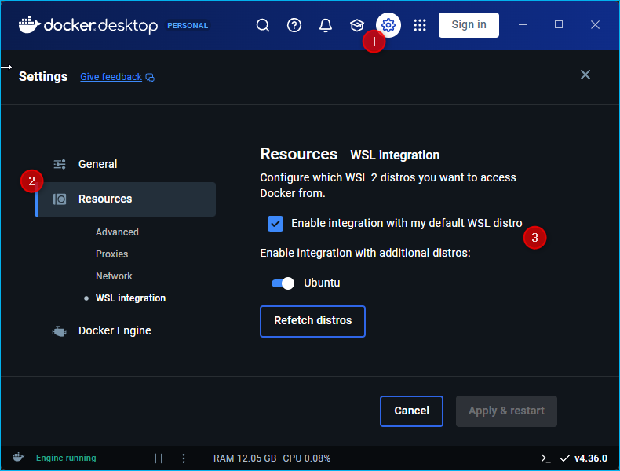

# Running ursim docker container in WSL2

The following instructions show how to use the `docker-compose.yml` file to
setup a docker container with ursim.

To run docker container in WSL2, you need to have WSL2 and docker engine installed.
If you do not have them installed then follow the steps in

[Install WSL2](#install-wsl2)

[Install Docker Desktop](#install-docker-desktop)

## Clone this ursim repositiory

Open your WSL2 terminal and clone this repository via `git clone` into
`docker/ursim` folder in your home folder.

## Create and start docker container

`cd` into `docker/ursim` and execute the following command:

```bash
docker compose up -d
````

This should start and run the docker container `ur5e_container`. You can check
in the docker desktop UI if the container is running.

## Connect to VNC server

You have now two options to connect to ursim:

1. You can use a VNC client like [UltraVNC](https://uvnc.com/downloads/ultravnc.html) viewer
   to connect to ursim using `localhost:5090`
2. You can connect via a browser using the Url [http://localhost:6080/vnc_auto.html](http://localhost:6080/vnc_auto.html).

## Install WSL2

1. Open **PowerShell** as Administrator and install WSL if it isn't already installed:

   ```powershell
   wsl --install
   ```

   This will install the default Linux distribution and set WSL2 as the default version.

1. Set WSL2 as Standard-Version

   Run the following command

   ```powershell
   wsl --set-default-version 2
   ```

## Install Docker Desktop

1. Download and install Docker Desktop from the [official Docker website](https://www.docker.com/products/docker-desktop/).

2. During installation:
   - Ensure the option **Use the WSL 2 based engine** is selected.
   - Choose the Linux distributions to integrate with Docker.

3. After installation, open Docker Desktop and go to **Settings** > **Resources** > **WSL Integration**:
   - Enable integration with your WSL2 Linux distribution.

   

4. Start Docker Desktop and verify that it's running.
